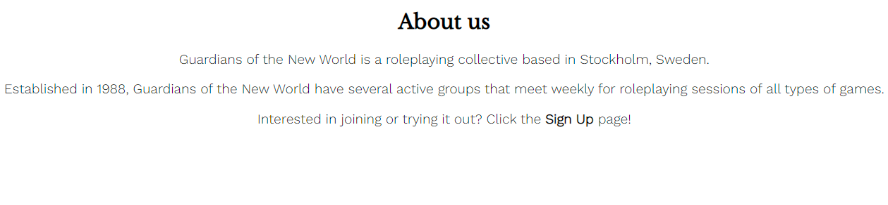

# Guardians of the New World

- Introduction
- Features
- Testing
- Deployment
- Credits

---

## **Introduction**

Ever wanted to brave a dungeon? Maybe battle a dragon?

Then join the wonderful world of roleplaying games!

Guardians of the New World is a closeknit and welcoming band of fellow gamers, always wanting to help others get into the hobby that they themselves love so much.

The Guardians of the New World webpage is a tool to lower the threshold for gamers to find and get in touch with likeminded fellows.

Maybe you're new to games? Maybe you're new in town? Doesn't matter! You are just as welcome either way.

Just use our handy dandy sign up form or drop in for an inpromptu visit at our locale. The roleplaying collective grows and the user has the chance to find new friends and an amazing hobby. Win-Win!

### **Screenshots**

- Here are some images of the finished product

---

## **Features**

### **Logo**

- The logo exists to create awareness of the name and brand of the group. The Logo is consistent and featured on all three pages.

- It is one of the first things you see when loading the web page and helps avoid confusion regarding which group this is.

---

### **Navbar**

- The navbar exists so that users can easily navigate the different pages as well as to clarify which of the three pages they are currently on.

- The navbar is consistent on all three pages and removes the need to rely on that pesky 'back' button.

---

### **About Us**

- The about us section makes clear who the Guardians of the New World are and what it is that we do.

- It also has a link to the sign up page to make it easier to reach out to the group.

---

### **Location**

- The location section shows where the Guardians of the New World can be found and also contains information on how spacious and air-conditioned the rooms are to be both lighthearted but also to further invite people in.

---

### **Social Media Footer**

- The social media footer is available on all three pages of the website and is there to invite the user to click the links to experience what else the Guardians of the New World have to offer and show off on social media.

- Ive chosen the colors black and grey because black is a rich distinct color which is easy to see and the grey because it has colors in common with the home image and they don't clash.

---

### **Sign Up Form**

- This call to action helps the user come into contact with the roleplaying collective to find out if there are any groups in particular that might suit their fancy.

- It also asks the user if they have any additional info. This information can be used to further tailor the search for a group that meets their needs, schedules and interests.

- The color for the background of the sign up form was chosen to meet half way between the footer and the sign up image. It is gray like the footer but has more blue in it which is a complimentary color to the orange of the sign up image.

---

### **Gallery**

- The gallery exists to showcase the games in action as well as some of the faces you might meet.

- The colorful pictures depict roleplaying sheets, dice and miniatures to give users more of an idea what they can expect and what cool things they will get to do if they join the Guardians of the New World.

---

## **Testing**

### **Validation**

- All HTML pages have been checked with the official W3C HTML validator and received no errors.

- The CSS page have been checked with the official jigsaw W3C CSS validator and comes back with no errors.

### **Responsiveness**

- All three pages have been thoroughly checked on desktop with browsers Chrome, Edge and Opera with no irregularities found.

- Testing to ensure that the pages are responsive have been done in devtools as well as on my own and my girlfriends smartphones.

### **Bugs**

- A bug with the navbar being covered by the home image as well as the sign_up image was resolved by removing float left on the logo and giving the menu a height of auto.

- No currently known unfixed bugs.

### **Version Control**

- The live site has been version controlled to ensure that it is up-to-date.

### **Lighthouse**

- All three pages have been run through the Lighthouse function both on devtools and on [pagespeed.web.dev](https://pagespeed.web.dev)

- All three pages received good scores on accessability. The low scores on performance are due to large unwieldy images. I tried replacing them with lower resolution versions with smaller file sizes but since that left them blurry and visually unappealing i decided against it.

---

## **Deployment**

- The site was deployed through Github pages. The following are the steps i took to do so.

- In the github repository for the project i first click on 'settings'.

- Then on the left hand side of the screen i click the 'pages' option

- I then chose to deploy from a branch and when asked what branch to deploy from i select 'main branch'.

- After a few minutes i can now see that the page is deployed and that the site is live.

- The current live site is [Here](https://lobiax.github.io/guardians-of-the-new-world/)

---

## **Credits**

### **Media**

- All images that are used were taken from the swedish language version of [Shutterstock](https://www.shutterstock.com/sv/) using a free trial.

- The icons in the footer were taken from [Font Awesome](https://fontawesome.com)

### **Content/Code**

- The Love Running project was a big inspiration and was used to see proper syntax and logic.

- The only lines of code directly copied was the CSS for creating a gallery with columns. This was taken from Love Running.
